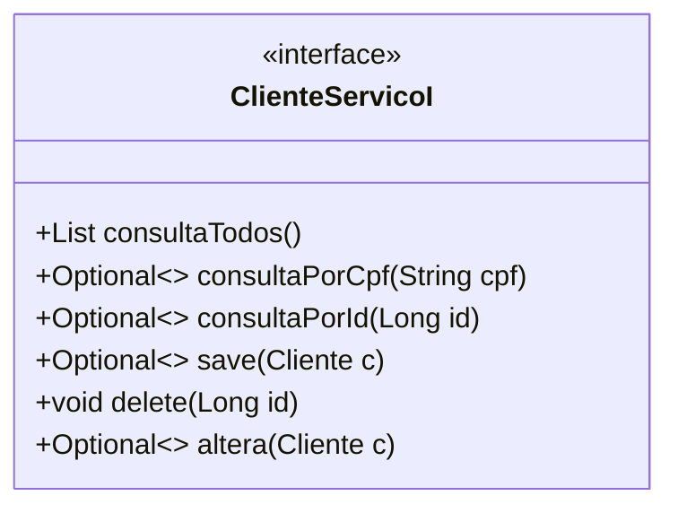
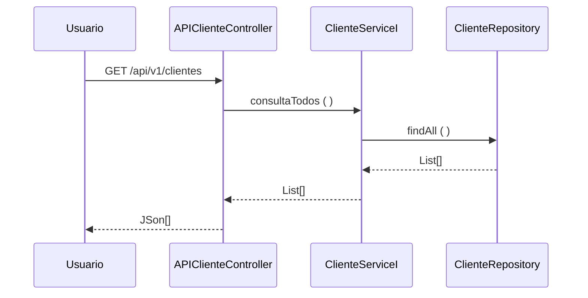

  ### Fatec ZL - Centro Paula Souza
##### Disciplina - Programação Web III
Grupo 6
- Gabriel Magalhães de Oliveira
- Dalton Joaquim Soares Guimarães
- Lucas Albuquerque Paradella
- Matheus de Carvalho Simões
##### Processo de Desenvolvimento de Software - PDS
> O PDS segue uma abordagem interativa incremental adaptada do Scrum. Cada interação tem uma definição de pronto estabelecida com objetivo de controlar a qualidade.
##### Estudo de Caso – Sistema de Montagem de Desktops e Interação entre os Usuários
> No contexto do projeto interdisciplinar o estudo de caso tem como objetivo desenvolver e implantar um Sistema de Montagem de Desktops e Interação entre os Usuários.
Os seguintes requisitos foram identificados na primeira reunião com o cliente (RU – Requisito de Usuário). O resultado da análise conclui que será possível implementar
o projeto no semestre com grupos de alunos atuando como programadores. O maior risco identificado é a falta de tempo para reunião do time de desenvolvimento e estudo
do projeto. O grupo deve definir estratégias para mitigar o risco de dificuldades com a linguagem de programação, identificando membros do grupo com problemas na
programação, selecionando videoaulas, referência bibliográficas, para melhora a produtividade do time.
##### Product Backlog
- RU01 - Compras - Registra e acompanha os processos de compras na organização, prevê a entrega programada de pedidos de compra
- RU02 - Recebimento - Registra, controla e informa sobre a entrada de mercadorias e integra as informações dos dados da nota fiscal de entrada com o estoque
- RU03 - Vendas – Registra e acompanha as vendas mantendo as informações integradas com o controle de estoque.
##### Sprint Backlog
> Cada requisito tem um identificador único de maneira que seja possível rastrear a necessidade do cliente com a implementação do software.

| Identificador | Descrição | Prioridade |
##### Estudo de Caso – Sistema Integrado de Gestão
> No contexto do projeto interdisciplinar o estudo de caso tem como objetivo desenvolver e implantar um Sistema Integrado de Gestão de Vendas e Suprimentos.
Os seguintes requisitos foram identificados na primeira reunião com o cliente (RU – Requisito de Usuário). O resultado da análise conclui que será possível implementar
o projeto no semestre com grupos de alunos atuando como programadores. O maior risco identificado é a falta de tempo para reunião do time de desenvolvimento e estudo
do projeto. O grupo deve definir estratégias para mitigar o risco de dificuldades com a linguagem de programação, identificando membros do grupo com problemas na
programação, selecionando videoaulas, referência bibliográficas, para melhora a produtividade do time.
##### Product Backlog
- RU01 - Compras - Registra e acompanha os processos de compras na organização, prevê a entrega programada de pedidos de compra
- RU02 - Recebimento - Registra, controla e informa sobre a entrada de mercadorias e integra as informações dos dados da nota fiscal de entrada com o estoque
- RU03 - Vendas – Registra e acompanha as vendas mantendo as informações integradas com o controle de estoque.
##### Sprint Backlog
> Cada requisito tem um identificador único de maneira que seja possível rastrear a necessidade do cliente com a implementação do software.
### 
| Identificador | Descrição | Prioridade |
| ------------ | ------------------------------------------------------------------------ | ------|
| REQ01 – cadastrar cliente | Como – vendedor, Eu quero – cadastrar o cliente, De maneira que – seja possível identificar o cliente e o endereço de entrega para confirmar uma venda| Média |
| REQ02 – consultar cliente por ID| Como – vendedor, Eu quero – consultar um cliente pelo ID, De maneira que – seja possível obter informações detalhas do cliente | Alta |
| REQ03 – consultar cliente por CPF | Como – vendedor, Eu quero – consultar um cliente, De maneira que – seja possível obter informações detalhas do cliente | Alta |
| REQ04 – consultar todos os clientes | Como – vendedor, Eu quero – consultar todos os clientes cadastrado, De maneira que – seja possível obter uma lista de clientes | Baixa |
| REQ05 – corrigir informações de cliente | Como – vendedor, Eu quero – corrigir as informações do cliente, De maneira que – seja possível manter as informações atualizadas | Baixa |
| REQ06 – excluir cliente | Como – vendedor, Eu quero – excluir um cliente, De maneira que – seja possível manter informações somente de clientes ativos | Baixa |
>teste

##### Definição de pronto
> O sprint será considerado concluido quando:
> 1) Os casos de teste de aceitação forem executados e obtiverem 100% de satisfatorios. Os casos de teste (CT) são rastreáveis para os requisiitos (REQ). O elo de rastreabilidade
é estabelecido pelo identificador do caso de teste.
> 2) Depois de executado os casos de teste com 100% de satisfatorios o código deve ser armazenado no github (commit).
##### Casos de teste
| Identificador | Cenário de uso |
| ------------ | ------------------------------------------------------------------------ |
| REQ01CT01 | Dado (setup) que o CPF do cliente não está cadastrado; Quando (ação) o usuário confirma o cadastro; Então (resultado esperado) o sistema envia uma mensagem de cadastro realizado com sucesso |
| REQ01CT02 | Dado (setup) que o CPF do cliente está cadastrado; Quando (ação) o usuário confirma o cadastro; Então (resultado esperado) o sistema rejeita e envia uma mensagem de dados inválidos |
>
O modelo de dominio (Larman, 2006 - classes conceituais ou classes de negócio) foi definido considerando as seguintes classes:

A arquitetura segue uma abordagem orientada a serviços. Os serviços foram classificados em três tipos (ERL, 2007):
- **1. Serviços utilitários**. Implementam funcionalidades comuns a vários tipos de aplicações, como, por exemplo: log, notificação, transformação de informações. Um exemplo de serviço utilitário é um serviço de conversão de moeda que
poderá ser acessado para calcular a conversão de uma moeda (por exemplo, dólares) para outra (por exemplo, euros).
- **2. Serviços de entidade (serviços de negócios)**. Derivado de uma ou mais entidades de negócio (domínio), possuindo um alto grau de reutilização. Geralmente são serviços que fazem operações CRUD (Create, Read, Update e Delete).
- **3. Serviços de tarefa (coordenação de processos-workflow)**. Tipo de serviço mais específico que possui baixo grau de reuso. Consome outros serviços para atender seus consumidores. São serviços que suportam um processo de negócios
amplo que geralmente envolve atividades e atores diferentes. Um exemplo de serviço de coordenação em uma empresa é um serviço de pedidos em que os pedidos são feitos, os produtos são aceitos e os pagamentos são efetuados.
A visão lógica da arquitetura para API de Cliente é apresentada na figura abaixo. A visã lógica descreve como o código está organizado, as classes os pacotes e os relacionamentos entre eles.

>A entidade Cliente foi identificada como um serviço (ERL, 2007 - serviço do tipo entidade) o contrado das operações de sistema (LARMAN, 2006, pag.140) foram definidas no diagrama abaixo.

>O diagrama de sequência descreve como os varios componentes arquiteturais colaboram para manipular uma operação de sistema (exemplo para operação consultaTodos())

>Referencias
- [1] KRUCHTEN, Philippe. Reference: Title: Architectural blueprints—the “4+ 1” view model of software architecture. IEEE software, v. 12, n. 6, 1995.
- [2] RICHARDSON, Chris. Microservices patterns: with examples in Java. Simon and Schuster, 2018.
- [3] ERL, Thomas. SOA principles of service design (the Prentice Hall service-oriented computing series from Thomas Erl). Prentice Hall PTR, 2007.
- [4] LARMAN, Craig. Utilizando UML e padrões. 2aed., Porto Alegre: Bookman Editora, 2006 (pag. 147).

##### Definição de pronto
> O sprint será considerado concluido quando:
> 1) Os casos de teste de aceitação forem executados e obtiverem 100% de satisfatorios. Os casos de teste (CT) são rastreáveis para os requisiitos (REQ). O elo de rastreabilidade
é estabelecido pelo identificador do caso de teste.
> 2) Depois de executado os casos de teste com 100% de satisfatorios o código deve ser armazenado no github (commit).
##### Casos de teste
| Identificador | Cenário de uso |
| ------------ | ------------------------------------------------------------------------ |
| REQ01CT01 | Dado (setup) que o CPF do cliente não está cadastrado; Quando (ação) o usuário confirma o cadastro; Então (resultado esperado) o sistema envia uma mensagem de cadastro realizado com sucesso |
| REQ01CT02 | Dado (setup) que o CPF do cliente está cadastrado; Quando (ação) o usuário confirma o cadastro; Então (resultado esperado) o sistema rejeita e envia uma mensagem de dados inválidos |
>
O modelo de dominio (Larman, 2006 - classes conceituais ou classes de negócio) foi definido considerando as seguintes classes:

A arquitetura segue uma abordagem orientada a serviços. Os serviços foram classificados em três tipos (ERL, 2007):
- **1. Serviços utilitários**. Implementam funcionalidades comuns a vários tipos de aplicações, como, por exemplo: log, notificação, transformação de informações. Um exemplo de serviço utilitário é um serviço de conversão de moeda que
poderá ser acessado para calcular a conversão de uma moeda (por exemplo, dólares) para outra (por exemplo, euros).
- **2. Serviços de entidade (serviços de negócios)**. Derivado de uma ou mais entidades de negócio (domínio), possuindo um alto grau de reutilização. Geralmente são serviços que fazem operações CRUD (Create, Read, Update e Delete).
- **3. Serviços de tarefa (coordenação de processos-workflow)**. Tipo de serviço mais específico que possui baixo grau de reuso. Consome outros serviços para atender seus consumidores. São serviços que suportam um processo de negócios
amplo que geralmente envolve atividades e atores diferentes. Um exemplo de serviço de coordenação em uma empresa é um serviço de pedidos em que os pedidos são feitos, os produtos são aceitos e os pagamentos são efetuados.
A visão lógica da arquitetura para API de Cliente é apresentada na figura abaixo. A visã lógica descreve como o código está organizado, as classes os pacotes e os relacionamentos entre eles.

>A entidade Cliente foi identificada como um serviço (ERL, 2007 - serviço do tipo entidade) o contrado das operações de sistema (LARMAN, 2006, pag.140) foram definidas no diagrama abaixo.

>O diagrama de sequência descreve como os varios componentes arquiteturais colaboram para manipular uma operação de sistema (exemplo para operação consultaTodos())

>Referencias
- [1] KRUCHTEN, Philippe. Reference: Title: Architectural blueprints—the “4+ 1” view model of software architecture. IEEE software, v. 12, n. 6, 1995.
- [2] RICHARDSON, Chris. Microservices patterns: with examples in Java. Simon and Schuster, 2018.
- [3] ERL, Thomas. SOA principles of service design (the Prentice Hall service-oriented computing series from Thomas Erl). Prentice Hall PTR, 2007.
- [4] LARMAN, Craig. Utilizando UML e padrões. 2aed., Porto Alegre: Bookman Editora, 2006 (pag. 147).
